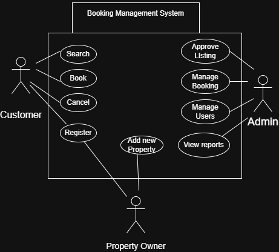

# Requirement Analysis in Software Development

This repository documents the process of Requirement Analysis for a booking management system as part of the ALX ProDev Challenge.

## 📌 Purpose

The goal of this project is to simulate a real-world software development scenario by identifying, documenting, and analyzing functional and non-functional requirements. The project follows industry best practices and includes user stories, use case diagrams, and acceptance criteria to ensure clarity and alignment with user needs.
## 📖 What is Requirement Analysis?

Requirement Analysis is a critical phase in the Software Development Life Cycle (SDLC) where the needs, goals, and expectations of stakeholders are gathered, analyzed, and clearly documented. It serves as the foundation for all subsequent stages of software development, ensuring that the final product is aligned with business objectives and user expectations.

### 🔍 Why Requirement Analysis is Important

- **Clarity and Understanding**: It helps the development team understand exactly what the stakeholders need, minimizing ambiguity and confusion.
- **Scope Definition**: Clearly defines what will be built and what will not, preventing scope creep and wasted effort.
- **Planning and Estimation**: Helps in accurately estimating time, cost, and resources required for the project.
- **Foundation for Design**: Guides the design and development of the system by providing a solid understanding of system requirements.
- **Ensures Quality**: Helps ensure the final product meets both functional and non-functional expectations, improving user satisfaction.

Requirement Analysis typically includes activities like requirement gathering, documentation, modeling, prioritization, and validation. It’s essential for building reliable, scalable, and user-friendly systems.
## 🌟 Why is Requirement Analysis Important?

Requirement Analysis is one of the most vital phases in the software development lifecycle. It lays the groundwork for successful project delivery by ensuring that all stakeholders are aligned on what the system should do and how it should behave.

Here are three key reasons why it is important:

### 1. ✅ Prevents Miscommunication and Errors
Requirement Analysis creates a shared understanding among stakeholders, developers, and testers. This reduces confusion and helps prevent costly mistakes or rework during development.

### 2. ⏱️ Enables Accurate Planning and Estimation
By defining clear and detailed requirements, teams can better estimate timelines, resources, and costs. This improves project predictability and helps avoid overruns.

### 3. 🎯 Guides System Design and Development
Requirements act as a blueprint for developers. Functional and non-functional requirements guide the system's structure, behavior, and performance expectations, ensuring the final product meets user needs and business goals.
## 🛠️ Key Activities in Requirement Analysis

Requirement Analysis involves several structured activities that help define what the software system should do and how it should behave. Here are the five key activities:

- **Requirement Gathering 🗂️**  
  - Collect raw requirements from stakeholders through interviews, surveys, workshops, and observations.
  - Understand stakeholder needs, expectations, and business context.

- **Requirement Elicitation ✍️**  
  - Refine and expand gathered data into usable information.
  - Techniques include brainstorming, focus groups, and prototyping.
  - Helps clarify assumptions and uncover hidden requirements.

- **Requirement Documentation 📚**  
  - Document all functional and non-functional requirements clearly.
  - Create Requirement Specification Documents, User Stories, and Use Cases for consistent communication and traceability.

- **Requirement Analysis and Modeling 📊**  
  - Analyze the feasibility, importance, and impact of each requirement.
  - Create models such as Data Flow Diagrams (DFDs) or Entity Relationship Diagrams (ERDs) for visualization and structure.
  - Prioritize requirements based on business value.

- **Requirement Validation ✅**  
  - Ensure documented requirements accurately reflect stakeholder needs.
  - Involve stakeholders to review, confirm, and approve the requirements.
  - Define acceptance criteria and maintain traceability.
## 📑 Types of Requirements

In software development, understanding both functional and non-functional requirements is crucial to building a system that meets user and business expectations. Below are the definitions and examples for each type of requirement, based on the Booking Management System case study.

---

### ✅ Functional Requirements

Functional requirements describe what the system should do — the specific functions, features, and operations that must be implemented.

**Examples for the Booking Management System:**
- Users must be able to register and create an account.
- The system should allow users to search for available properties by location and date.
- Users must be able to book, cancel, and reschedule their reservations.
- Property owners should be able to list new properties and manage bookings.
- The system must send booking confirmation emails to users.

---

### 🔒 Non-functional Requirements

Non-functional requirements define how the system performs its functions. These relate to system performance, usability, security, and reliability.

**Examples for the Booking Management System:**
- The website should load within 2 seconds on standard broadband connections.
- The system should be available 99.9% of the time (high availability).
- All user data must be encrypted at rest and in transit.
- The platform should support up to 10,000 concurrent users.
- The user interface must be responsive and accessible on mobile, tablet, and desktop devices.

## 🎯 Use Case Diagrams

Use Case Diagrams are a visual representation of how users (actors) interact with a system to achieve specific goals. They help stakeholders and developers understand the system's functionality from the user's perspective.

### 💡 Benefits of Use Case Diagrams:
- Clarify system boundaries and user interactions.
- Simplify complex system behavior through visualization.
- Facilitate communication between technical and non-technical stakeholders.
- Serve as a foundation for functional requirement documentation.

---

### 🧩 Use Case Diagram for Booking Management System

The diagram below illustrates the main actors and their interactions with the booking management system:

